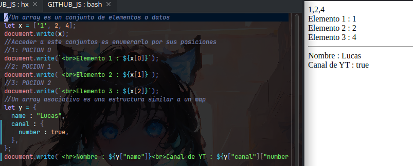

# ARRAY
Un *array* es un conjuntos de datos, que nos permite trabajar con una estructura de datos 
organizada de manera *lineal*.  
El mismo que para acceder a cada elemento, es mediante su *indice de posicion*
# EXAMPLE
En este caso, lo representamos como si fuera un conjunto de **cartas POKEMON**, donde si sabemos su posicion, podemos usar esta carta.


> Entonces un array es eso es como tener un maso de cartas para usar y compilar nuestro programa
> (DOCK-8, 2024) 

|INDICE|VALUE|
|------|-----|
|0|Mewtwo|
|1|Charizard|
|2|Pikachu|

> Este array es un conjunto de 3 cartas *POKEMON* : `lenght = 3`

# ARRAY ASOCIATIVO
Un *array asociativo* es un conjuntos de datos relacionados a una llave, que nos permite trabajar como una BD-No-Relaional 
organizada de manera *estructural*.  
El mismo que para acceder a cada elemento, es mediante esta *key*.
# EXAMPLE
Para entenderlo usemos el archivo mas comun para la comunicacion entre servicios **JSON**.

```json
{
  "dato" : "entero",
  "contenido" : "2+2",
  "autor" : "Lucas",
}
  
```
> Formato : `{KEY : VALOR}`, es decir, usar la `KEY` para abrir la puerta para ver el `VALOR` que relaciona.

# IMAGEN DE EJECUCION



