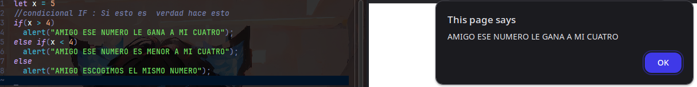

# CONDITION
Bueno ahora hablemos de las condicionales, estas son como rutas que tomamos 
si algo o alguien nos da una razon para hacerlo, por lo que, esto lo podemos 
tomar como si fuera un laberinto que sigue una persona para llegar a un punto.

|CONDICION|DESCRIPCION|
|---|---|
|IF| Esta es una sentencia para decidir: si se cumple algo, hacemos esto|
|ELSE IF| Esta representa como una sentencia que si no se cumple lo del if entonces pasamos al plan B que tambien depende de algo|
|ELSE| Este es un camino por default, que tomamos si los `n` planes no logran cumplirse.|

# EXAMPLE
En este caso vamos a ilustrar este laberinto con `n` caminos pero que cada uno tiene una 
condicion para seguirlo.

# ACLARACION
Cuando usamos el `else if`, en realidad es un plan de respaldo si el primer plan falla (`if`), por 
lo tanto, podemos tener muchos planes secundarios (`else if`), si nuestro `if` no funciona.  
Pero si tuvieramos un primer `if` y luego otro `if`, esto es como cuando terminas el primer laberinto y te toca 
resolver otro seguido, entonces estos dos caminos creados por los `if`, no se relacionan en nada entre si.

# IMAGEN DE EJECUCION

