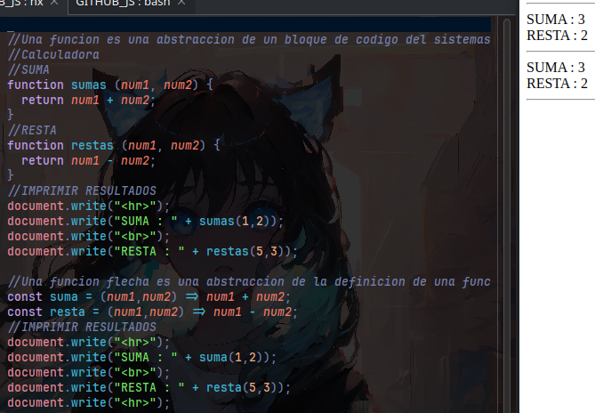

# FUNCIONES EN JAVASCRIPT

## 1. ¿Qué es una función?
Una función es una abstracción de un bloque de código que realiza una tarea específica y puede ser reutilizada en diferentes partes de un sistema.

---

## 2. FUNCIONES TRADICIONALES
Las funciones tradicionales se declaran utilizando la palabra clave `function` seguida del nombre de la función, los parámetros y el cuerpo de la función.

## EJEMPLO

```javascript
function sumas(num1, num2) {
  return num1 + num2;
}
```

> Este código imprime los resultados de la suma y la resta utilizando las funciones tradicionales.

---

## 3. FUNCIONES FLECHA
Las funciones flecha son una forma abreviada de declarar funciones en JavaScript. Estas se introdujeron en ES6 y tienen una sintaxis más concisa.

## EJEMPLO

```javascript
const suma = (num1, num2) => num1 + num2;
```

## DIFERENCIAS ENTRE FUNCIONES TRADICIONALES Y FUNCIONES FLECHA
1. **Sintaxis:** Las funciones flecha tienen una sintaxis más compacta.
2. **`this` Contexto:** Las funciones tradicionales crean su propio contexto de `this`, mientras que las funciones flecha no lo hacen, heredando el contexto de su entorno.

---

## IMAGEN DE EJECUCIÓN



> Esta imagen muestra la salida generada por el código de las funciones tradicionales y las funciones flecha.


