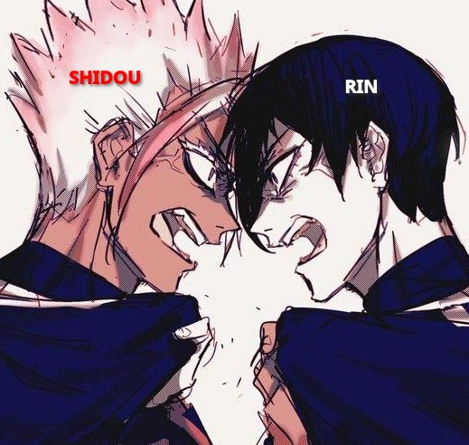
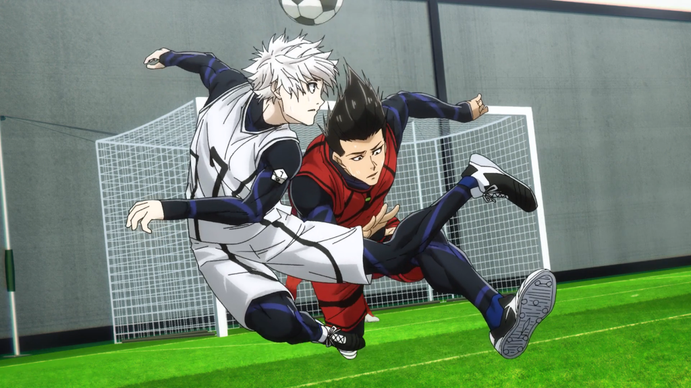
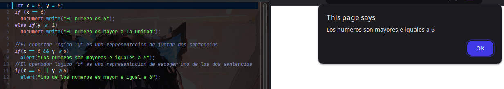

# LOGICAL OPERATOR
Los operadores logicos, son una forma trabajr con sentencia logicas, osea partes que devuelven un bool, 
entonces, como ya se dieron cuenta trabajaremos con algebra boolena pero, solamente con el dos operadores:

## AND
Este operador, siempre se ensañarlo como, si fuera cuando te dicen que, trabajes con *RIN* y *SHIDOU*

> Te lo resumo : Si uno de ellos trabaja de la peor manera el resultado del partido es negativo

|RIN|AND|SHIDOU|RESULT|
|--|--|--|--|
|true|&&|true| : true|
|true|&&|false| : false|
|false|&&|true| : false|
|false|&&|false| : false|

## OR
En el caso de este operador, sera cuando haces equipo con *BAROU* y *NAGI*

> Te lo resumo : Si por lo menos uno de ellos trabaja de la mejor manera el resultado del partido siempre sera positivo

|BAROU|OR|NAGI|RESULT|
|--|--|--|--|
|true|or|true| : true|
|true|or|false| : true|
|false|or|true| : true|
|false|or|false| : false|

# IMAGEN DE EJECUCION

