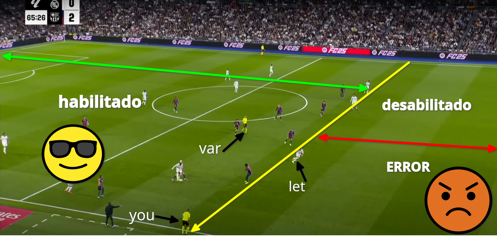

# VARIABLE SCOPE
Si bien las variables de *JS* son muy versatiles tambien es bueno conocer 
las nuevas integracion como lo fueron de **JS 6** que integro el tipo de 
variables ***let*** y ***var***.
|--------|---|
|VAR|LET|
|Esta es una variable que podriamos relacionar como si fuera un jugador de futbol 
habilitado, en una zona especifica que nosotros como arbitros de linea, podemos 
definirlos como fuera de lugar.|Por otro lado, tenemos al arbitro que tiene la libertad en toda la cancha de futbol 
(codigo JS).|
# EXAMPLE

# SUGERENCIA
Entonces ahora que conoces tu poder, recuerda que:  
*UN GLAN PODEL TIENE UNA GLAN LESPONSABILIDAD PAPU* (Dock, 2024)
  
Entonces controla al kiki

