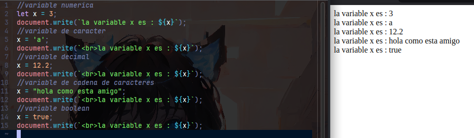

# VARIABLE EN JAVASCRIPT
Una variable es un espacio en memoria que utilizamos para almacenar algun tipo de dato que
nosotros fueramos a utilzar ahora o en el futuro

Relacionalo a un caja que puede guardar cualquier tipo de cosas, y con cualquier cosa me refiero a cualquier cosa ...

# TIPOS DE VARIABLE
En javascript, tenemos tipos de variables nativas, osea cosas que javascript tiene por defecto para el desarrollo de 
nuestros proyectos.
  


|Variable|Description|Lenght|Example|
|--------|-----------|------|-------|
|Integer (Enteros)|Almacena numeros enteros|4 bytes|4|
|Char (Caracter)|Almacena caracteres|1 bytes|'A'|
|Float (Decimales)|Almacena numeros decimales como enteros|8 bytes|3.54|
|String (Cadenas)|Almacena cadena de caracteres|n bytes|"CHARACTER"|

# ACLARACION
Si dijimos que una variable es un espacio para almacenar cosas, y luego les digo que hay tipo de cosas 
pensaras que tambien deben de haber un tipo de variable para un tipo de dato, y si tienes razon, pero en javascript 
esto es mas simple debido a sus variables dinamicas y adaptables.
Esto quiere decir que los datos no se adaptan a la variable, sino, la variable se adapta al dato, y por eso es que 
uno variable en un momento es un entero y en otro puede ser una cadena de texto.
```js
//La cajita tiene un tamaño de 4 bytes
let x = 6;
//La cajita ahora tiene un tamaño de 1 byte
x = 'A';
  
```
mientas que en otro lenguajes mas tipados como JAVA, este es mas restrictivo y tienes que escoger un tipo de variable 
para solamente albergar un tipo de dato
```java
//Escogo mi cajita que solo guarda enteros
int x = 5;
//ERROR
/*
* No puedes usar una caje de numeros para letras
* Acaso eres raro
*/
x = "Que decis gato";
```
